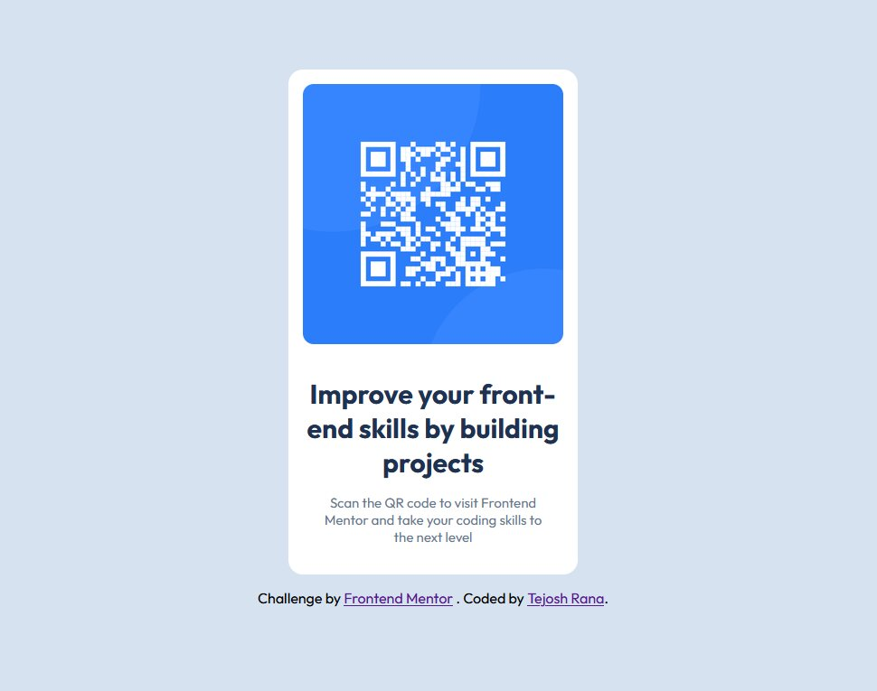

# Frontend Mentor - QR code component solution

This is a solution to the [QR code component challenge on Frontend Mentor](https://www.frontendmentor.io/challenges/qr-code-component-iux_sIO_H). Frontend Mentor challenges help you improve your coding skills by building realistic projects.

## Table of contents

- [Overview](#overview)
  - [Screenshot](#screenshot)
  - [Links](#links)
- [My process](#my-process)
  - [Built with](#built-with)
  - [What I learned](#what-i-learned)
  - [Continued development](#continued-development)
  - [AI Collaboration](#ai-collaboration)
- [Author](#author)

## Overview

### Screenshot



### Links

- Solution URL: [Add solution URL here](https://your-solution-url.com)
- Live Site URL: [Add live site URL here](https://your-live-site-url.com)

## My process

### Built with

- Semantic HTML5 markup
- CSS (Flexbox)
- Mobile-friendly, fixed-width card layout

### What I learned

- Loading a Google Font correctly requires importing the actual stylesheet endpoint.

```css
@import url('https://fonts.googleapis.com/css2?family=Outfit:wght@400;700&display=swap');
```

- Matching a style guide's exact color values (not close approximations) matters for accuracy against the design.
- Wrapping the main content in a `<main>` landmark instead of a bare `<div>` under `<body>` is a small but important semantic HTML habit.
- Even on a "fixed" (non-responsive) layout, the card still needs a `max-width` and some outer padding so it doesn't run edge-to-edge or overflow at very small viewports (320px).

### Continued development

- Get more comfortable setting up responsive layouts with breakpoints for future challenges that require them.
- Practice using CSS custom properties for color/spacing values instead of repeating literal values.

## Author

- GitHub - [@TeaJosh](https://github.com/TeaJosh) 
